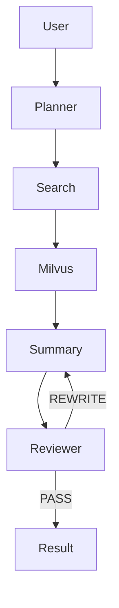

<div align="center">

# 🤖 Multi-Agent 智能搜索总结系统

> 基于 **LangGraph + LangChain + Milvus + FastAPI** 构建的多智能体智能搜索系统，实现 **规划 → 检索 → 总结 → 自动评审** 的完整 Agent Workflow。


</div>

---

# 🔥 项目亮点

### 🚀 基于 LangGraph 构建完整 Multi-Agent Workflow

采用 **Planner、Search、Summary、Reviewer** 四个 Agent，各自负责不同任务，通过 LangGraph 编排形成完整工作流，而不是传统的单 Agent Prompt。

---

### 🌐 支持联网搜索

接入 **Tavily Search API** 获取实时互联网信息，支持多轮搜索、网页内容整理与信息去重，使回答能够结合最新数据。

---

### 📚 RAG 检索增强

搜索结果经过 Embedding 后存储至 **Milvus 向量数据库**，Summary Agent 在生成内容前进行向量检索，提高回答的相关性，并降低上下文长度。

---

### 🧐 自动评审机制

引入 Reviewer Agent 自动评估总结质量。

当回答存在遗漏或逻辑问题时，会自动反馈给 Summary Agent 重新生成，形成：

```
Summary
     │
     ▼
Reviewer
     │
 PASS ?
 ┌───┴────┐
 │        │
Yes      No
 │        │
 ▼        ▼
输出    重新生成
```

实现简单的 Agent 闭环优化。

---

### ⚡ FastAPI 流式输出

后端采用 FastAPI 开发，并支持 StreamingResponse，实现 Agent 推理过程实时输出，方便前端展示。

---

### 🐳 Docker 部署

支持 Docker 快速部署 Milvus 服务，降低环境配置成本。

---

# 🏗 系统架构

```text
                    用户输入
                        │
                        ▼
              ┌─────────────────┐
              │ Planner Agent   │
              └─────────────────┘
                        │
                 生成搜索计划
                        ▼
              ┌─────────────────┐
              │ Search Agent    │
              └─────────────────┘
                        │
                 Tavily Search
                        │
                        ▼
                文档整理 & 去重
                        │
                        ▼
               Milvus 向量数据库
                        │
                RAG 相似度检索
                        │
                        ▼
              ┌─────────────────┐
              │ Summary Agent   │
              └─────────────────┘
                        │
                        ▼
              ┌─────────────────┐
              │ Reviewer Agent  │
              └─────────────────┘
                 │          │
               PASS     REWRITE
                 │          │
                 └────┬─────┘
                      ▼
                  最终回答
```

---

# 💡 项目设计思路

传统的单 Agent 在处理复杂搜索任务时通常存在以下问题：

- 无法自主规划搜索流程；
- 搜索内容容易遗漏；
- 回答质量缺乏自动评估；
- 上下文长度受限。

因此，本项目采用 **多 Agent 协同架构**，将任务拆解为多个职责明确的智能体：

| Agent | 职责 |
|--------|------|
| Planner | 分析用户问题，生成搜索计划 |
| Search | 联网检索相关资料，并完成文档整理 |
| Summary | 基于检索结果生成总结 |
| Reviewer | 自动评审总结质量，并决定是否重新生成 |

相比传统单 Agent，系统具有更好的**模块化设计、可扩展性与可维护性**。

---

# ⚙ 技术栈

| 模块 | 技术 |
|------|------|
| LLM | Qwen Plus |
| Workflow | LangGraph |
| Prompt | LangChain |
| Search | Tavily Search |
| Vector Database | Milvus |
| Embedding | BAAI/bge-small-zh-v1.5 |
| Backend | FastAPI |
| Deployment | Docker |

---

# 📂 项目结构

```text
Multi_Agent
│
├── main.py              # FastAPI 服务入口
├── agent_core.py        # LangGraph 工作流
├── agent.py             # Agent 状态定义
│
├── Planner.py           # Planner Agent
├── Search.py            # Search Agent
├── Summary.py           # Summary Agent
├── Reviewer.py          # Reviewer Agent
│
├── Env.py               # 配置文件
├── Dockerfile
├── requirements.txt
└── index.html
```

---

# 🚀 快速开始

## 1. 克隆项目

```bash
git clone https://github.com/DogHuang122/Multi_Agent.git
```

---

## 2. 安装依赖

```bash
pip install -r requirements.txt
```

---

## 3. 启动 Milvus

```bash
docker compose up -d
```

---

## 4. 配置 API Key

在 `Env.py` 中配置：

```python
DASHSCOPE_API_KEY = "你的 DashScope Key"

TAVILY_API_KEY = "你的 Tavily Key"
```

---

## 5. 启动项目

```bash
python main.py
```

浏览器访问：

```
http://localhost:8000
```

---

# 🔄 Agent Workflow



---

# 📌 项目特色

- 基于 LangGraph 构建多 Agent 工作流
- Tavily 实现联网搜索
- Milvus 构建长期向量记忆
- FastAPI 实现流式输出
- Docker 快速部署
- Reviewer 自动反馈优化
- RAG 检索增强生成
- 模块化设计，方便扩展新的 Agent

---

# ⚡ 开发过程中解决的问题

## 多 Agent 状态共享

利用 LangGraph 的 StateGraph 管理整个工作流状态，实现多个 Agent 之间的数据共享，避免上下文重复传递。

---

## 长文本检索

采用 Milvus + BGE Embedding 构建向量数据库，通过相似度检索减少上下文长度，提高生成质量。

---

## 流式输出

使用 FastAPI StreamingResponse 实现 Agent 推理过程实时输出，提升用户交互体验。

---

## Agent 自动评审

通过 Reviewer Agent 对生成结果进行质量检查，并形成简单的反馈闭环，使系统具备初步自优化能力。

---

# 📈 后续优化

- [ ] 引入 MCP Tool Calling
- [ ] Browser Agent
- [ ] 支持多模型路由（Qwen / DeepSeek / GPT）
- [ ] Agent 长期记忆优化
- [ ] 自动引用来源
- [ ] 多轮对话
- [ ] WebUI 美化

---

# ⭐ Star

如果这个项目对你有所帮助，欢迎点一个 Star ⭐。